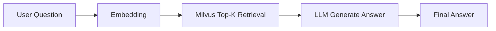
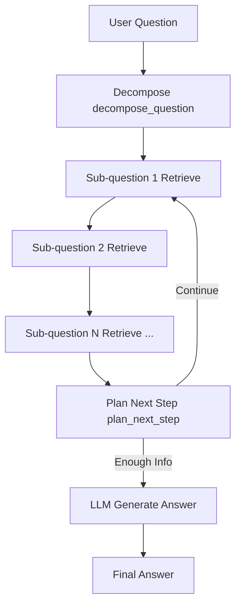
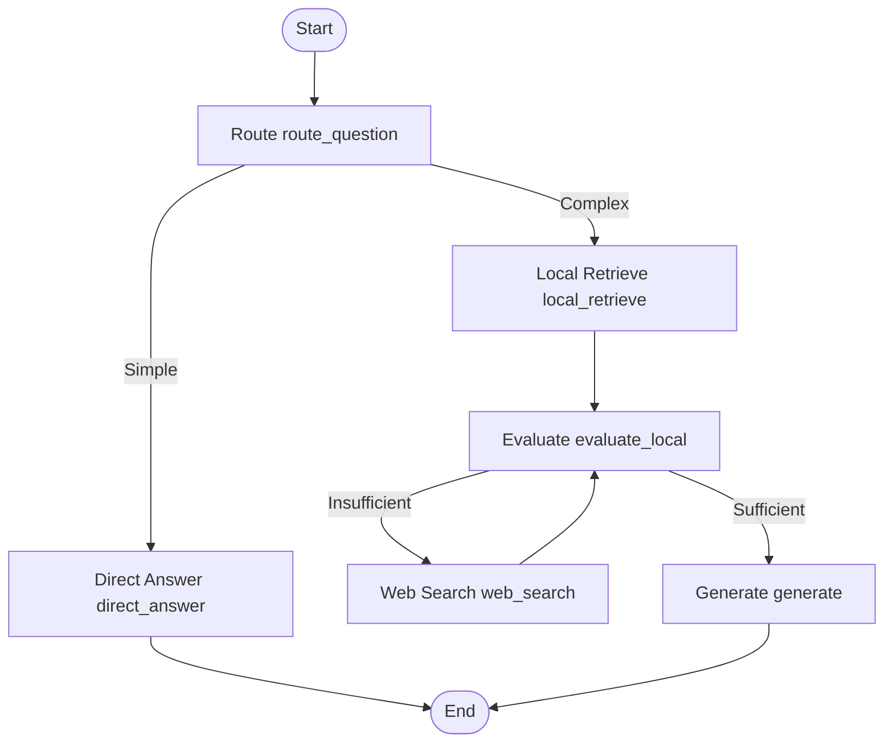

# Project Overview

This project is a **LangGraph**-based **Agentic RAG (Retrieval-Augmented Generation)** learning and practice repo. It uses the e-book of Jin Yong's martial arts novel *Demi-Gods and Semi-Devils* (天龙八部) as the knowledge base, demonstrating the evolution from naive RAG to multi-hop retrieval, and finally to Agentic RAG with routing and evaluation.

## Tech Stack

| Component | Purpose |
|-----------|---------|
| **LangGraph** | Orchestrates the RAG workflow (nodes, conditional edges, state machine) |
| **Milvus** | Vector database storing e-book chunk embeddings |
| **OpenAI API** | Chat model (routing, evaluation, answer generation) |
| **Ollama** | Local embedding model (`nomic-embed-text`, 768 dimensions) |
| **Zod** | Structured output schema validation |

## Project Structure

```
src/
├── naive-rag.mjs              # Main entry: LangGraph assembly and execution
├── config/rag.mjs             # Collection name, TOP_K, etc.
├── state/graphState.mjs       # Graph state field definitions
├── nodes/
│   ├── routeQuestionNode.mjs  # Routing, local retrieval, evaluation, web search
│   └── ragNodes.mjs           # Multi-hop retrieval and answer generation
├── services/
│   ├── llm.mjs                # Chat and embedding model configuration
│   └── retriever.mjs          # Milvus retrieval, doc merging, web search
└── utils/language.mjs         # Chinese/English output language detection
```

## Knowledge Base

- **Milvus collection**: `ebook_collection`
- **Vector dimensions**: 768 (aligned with Ollama `nomic-embed-text`)
- **Record count**: ~3,042 e-book chunk records

---

# How to Run the Project

## Prerequisites

1. **Node.js** (v18+ recommended)
2. **pnpm** (or npm / yarn)
3. **Docker**: to run the Milvus vector database
4. **Ollama**: local embedding service
5. **OpenAI API Key**: for chat, routing, evaluation, and web search

## 1. Install Dependencies

```bash
pnpm install
```

## 2. Start Milvus

Ensure Milvus is running locally (default: `http://localhost:19530`) and that the `ebook_collection` data has been imported.

## 3. Start Ollama and Pull the Embedding Model

```bash
ollama serve
ollama pull nomic-embed-text
```

> **Note**: Indexing and query retrieval **must use the same embedding model**, or vector similarity scores become meaningless.

## 4. Configure Environment Variables

Create a `.env` file in the project root (use the template below; do not commit real secrets to Git):

```env
# Chat model (OpenAI-compatible API)
OPENAI_API_KEY=your-api-key
OPENAI_BASE_URL=https://api.openai.com/v1
MODEL_NAME=gpt-4.1-mini

# Embedding model (local Ollama)
OPENAI_EMBEDDING_BASE_URL=http://localhost:11434/v1
OPENAI_EMBEDDING_MODEL=nomic-embed-text
OPENAI_EMBEDDING_DIMENSIONS=768

# Milvus
MILVUS_URL=http://localhost:19530
```

## 5. Run the Project

```bash
node ./src/naive-rag.mjs
```

By default, this runs a multi-hop test question (about the second-ranked member of the Four Great Evils and the public identity of the child's father) and prints retrieval logs and the final answer to the terminal.

---

# RAG Architectures Used in This Project

This project has explored three RAG architectures of increasing complexity.

## Architecture 1: Naive RAG

The simplest **retrieve → generate** pipeline: embed the user question, retrieve Top-K documents from Milvus, then pass them to the LLM for answer generation.



**Characteristics**:
- Simple to implement, low latency
- Suited for single-hop, fact-based questions
- Poor performance on multi-hop reasoning (chaining facts across passages)

---

## Architecture 2: Multi-hop RAG

For complex questions, an LLM **decomposes the question into sub-questions**, retrieves documents round by round, merges them, and generates a final answer. Related node code lives in `ragNodes.mjs` and `routeQuestionNode.mjs`.



**Characteristics**:
- Breaks complex questions into retrievable sub-questions, improving multi-hop accuracy
- Supports multi-round retrieval and deduplicated merging (`mergeUnique`)
- More complex graph orchestration; max retrieval rounds must be controlled

**Example**: *"Who is ranked second among the Four Great Evils? What is the father's publicly known identity before the child's parentage is revealed?"* requires retrieving Ye Erniang, then Xuzhu's parentage, then linking to Abbot Xuanci.

---

## Architecture 3: Agentic RAG (Current Main Flow)

Builds on naive RAG with **agent-style decision making**: routing, local retrieval evaluation, web supplementation, and hallucination-aware generation. This is what `naive-rag.mjs` actually runs today.



**Node Responsibilities**:

| Node | Function |
|------|----------|
| `route_question` | Judges question complexity; routes to direct answer or retrieval |
| `local_retrieve` | Retrieves local e-book knowledge from Milvus |
| `evaluate_local` | LLM evaluates whether local context is sufficient |
| `web_search` | Supplements with external info via OpenAI web search |
| `generate` | Generates the final answer from local + web context |
| `direct_answer` | Skips retrieval for simple questions |

**Characteristics**:
- Self-awareness: the evaluation node can judge whether information is sufficient
- Automatically triggers web search when local knowledge is insufficient
- Generation respects `evaluation.enough` to reduce unsupported hallucinations
- Supports Chinese and English questions; answer language follows the question language

---

# Problems and Pain Points Encountered

## 1. Embedding Model vs. Vector Store Mismatch

- The course example uses Alibaba Cloud DashScope `text-embedding-v3` (1024 dimensions). This project uses Ollama `nomic-embed-text` (768 dimensions) due to limited access to Alibaba Cloud.
- **Indexing and querying must use the same model**; mixing models makes retrieval effectively useless.

## 2. Document Deduplication Bug: Wrong `doc.id` Access

- `mergeUnique` once used `doc.id` instead of `doc.metadata?.id`, causing all documents to merge under `"unknown"` — 5 hits became 1.
- Retrieval results only accumulated correctly after this fix.

## 3. Missing LangGraph State Fields

- `GraphState` initially lacked `localContext`, `webContext`, and `evaluation`, so retrieval results could not flow between nodes and the evaluation node always saw empty context.
- Adding these fields fixed evaluation and generation.

## 4. Route Condition vs. Graph Node Mismatch

- `afterRoute` once returned `decompose_question`, but that node was not registered in the graph, causing `Branch condition returned unknown destination` at runtime.
- Conditional edge return values must exactly match `addNode` registered names.

## 5. Zod Schema vs. OpenAI Structured Output

- Setting `web_query` as `optional()` in `EvaluateSchema` caused OpenAI API 400 errors.
- Changed to required `z.string()`, passing `""` when unused.

## 6. Single Full-Question Retrieval Fails on Multi-hop Questions

- Embedding the entire complex question at once often hits book intros, Buddhist scripture references to "Demi-Gods and Semi-Devils", and other irrelevant chunks — not the Ye Erniang → Xuzhu → Xuanci reasoning chain.
- The current Agentic flow can supplement via web search, but multi-hop questions that depend heavily on the local corpus still need the multi-hop decomposition architecture re-wired in.

## 7. Trade-off Between Evaluation and Generation

- The evaluation node often returns `enough=false`, even after web search.
- `afterEvaluateLocal` forces `generate` once `webContext` exists to avoid infinite loops, but may still produce "cannot answer" or incorrect characters (e.g., Xiao Yuanshan / Qiao Feng).

---

# Future Plans and Integration

## Short Term

1. **Re-wire multi-hop decomposition**: integrate `decompose_question → retrieve → plan_next_step` into LangGraph alongside Agentic evaluation — forming a full pipeline of decompose → multi-round local retrieval → evaluate → web supplement → generate.
2. **Improve retrieval quality**: tune chunking strategy, add metadata filters (chapter number, character names) to reduce irrelevant hits.
3. **Better logging and observability**: distinguish run summary logs from the final answer for easier retrieval debugging.

## Medium Term

4. **Unify the embedding stack**: switching to DashScope or OpenAI embeddings requires a **full Milvus re-index**.
5. **Add CLI / Web UI**: allow custom user questions instead of hard-coded test prompts.
6. **Introduce a Reranker**: add cross-encoder reranking after Milvus coarse retrieval to improve Top-K precision.

## Long Term

7. **Multi-agent collaboration**: separate retrieval, evaluation, and writing agents orchestrated via LangGraph subgraphs.
8. **Knowledge base expansion**: support multiple books and multi-collection retrieval.
9. **Evaluation benchmark**: build a *Demi-Gods and Semi-Devils* QA test set to quantify accuracy and latency across all three architectures.

---

# Project Summary

This project uses the *Demi-Gods and Semi-Devils* e-book as a scenario and walks through three RAG evolution paths with **LangGraph + Milvus + LLM**:

| Architecture | Core Idea | Best For |
|--------------|-----------|----------|
| Naive RAG | Retrieve → Generate | Simple factual QA |
| Multi-hop RAG | Decompose → Multi-round Retrieve → Generate | Complex cross-passage reasoning |
| Agentic RAG | Route → Retrieve → Evaluate → Web → Generate | Open QA requiring self-assessment of evidence |

The main entry `naive-rag.mjs` currently runs the **Agentic RAG** flow. Multi-hop decomposition code is preserved in the repo and pending integration. Along the way, the project addressed practical issues including embedding config separation, state passing, document deduplication, and structured output schemas — laying groundwork for a fuller Agentic multi-hop RAG system.

**Built-in Test Question and Current Performance**

The default question in `naive-rag.mjs` is:

> 《天龙八部》中「四大恶人」排行第二的是谁？此人之子在身世揭晓前，其生父在武林中的公开身份是什么？

*(In English: Who is ranked second among the Four Great Evils in Demi-Gods and Semi-Devils? Before the child's parentage is revealed, what is the father's publicly known identity in the martial world?)*

Per the novel's canon, the **ground truth** is: second among the Four Great Evils is **Ye Erniang** (叶二娘); her son is **Xuzhu** (虚竹); before the parentage reveal, the father's publicly known identity is Shaolin Abbot **Xuanci** (玄慈).

However, **the current Agentic RAG flow usually cannot reliably produce this answer** — which is why the project is still evolving. Typical runtime behavior:

- Local Milvus retrieval hits book intros, Buddhist scripture "Demi-Gods and Semi-Devils" references, Duan Yanqing synopses, and other weakly related chunks;
- `evaluate_local` returns `enough=false`; web search may still leave the context insufficient;
- Final output is often "cannot answer from context", or incorrect characters (e.g., Xiao Yuanshan, Qiao Feng);
- Multi-hop decomposition nodes are not wired into the current graph; single full-question retrieval cannot complete the Ye Erniang → Xuzhu → Xuanci chain.

The ground truth above is an **evaluation benchmark only** — it does not represent the current output of `node ./src/naive-rag.mjs`.

---

# Open Issues and Root Cause Analysis

This section documents why the default test question **fails**, findings from debugging, and how this project differs from the course example — for reference when improving the system.

## Problem Description

Running `node ./src/naive-rag.mjs` with the default test question:

> 《天龙八部》中「四大恶人」排行第二的是谁？此人之子在身世揭晓前，其生父在武林中的公开身份是什么？

Novel ground truth: **Ye Erniang** → her son **Xuzhu** → father's publicly known identity before the reveal: Shaolin Abbot **Xuanci**.

**Observed behavior**: even with retrieval `k` raised to 8 or 10, the system cannot reliably produce the full correct answer. Common outputs include:

- Retrieval hits book postscripts, Juxian Manor scenes, Buddhist scripture "Demi-Gods and Semi-Devils" references, and other weakly related chunks;
- Evaluation returns `enough=false`; web search still cannot complete the reasoning chain;
- Final answer is "cannot determine from context", or wrong characters such as Xiao Yuanshan or Qiao Feng.

## Current Embedding Configuration

This project uses **separate services** for chat and vector retrieval (see `src/services/llm.mjs` and `.env`):

| Purpose | Model | Service | Dimensions |
|---------|-------|---------|------------|
| Chat / routing / evaluation / generation | `gpt-4.1-mini` | OpenAI API | — |
| **Embedding retrieval** | **`nomic-embed-text`** | **Local Ollama** (`localhost:11434`) | **768** |

The Milvus collection `ebook_collection` uses **768**-dimensional vectors, matching Ollama query output. There is **no dimension mismatch causing retrieval failure**.

## What Does "Weak Retrieval" Mean?

This does **not** mean Milvus or Ollama is down. It means:

> **After the embedding model converts a question into a vector, it often retrieves the wrong or irrelevant passages from the novel text.**

Retrieval flow: user question → `nomic-embed-text` produces a 768-dim vector → cosine similarity against Milvus chunk vectors → return Top-K.

`nomic-embed-text` is a general-purpose embedding model that works reasonably on English and generic text, but its semantic alignment for **Chinese martial arts fiction, character relationships, and multi-hop reasoning** is typically weaker than dedicated Chinese embeddings (e.g., Alibaba `text-embedding-v3`, BGE series).

Typical results when retrieving with Chinese sub-questions individually (similarity 0.73–0.78 — service works, but content is off-topic):

| Sub-question | Actual Top Hit | Issue |
|--------------|----------------|-------|
| Who is ranked second among the Four Great Evils? | Chapter titles containing "四" (e.g., "四 崖高人远") | Literal similarity, semantically unrelated |
| Who is Ye Erniang's son? | Chapters like "六 谁家子弟谁家院" | Misses the Ye Erniang–Xuzhu mother-son relationship |
| Xuzhu's parentage and father Abbot Xuanci | Xuzhu jumping through a roof, Veda Palm, Tianshan Tonglao scenes | Contains "Xuzhu" but not the parentage reveal passage |

Therefore, **increasing `k` only retrieves more "vector-similar but content-irrelevant" chunks** — it cannot automatically complete the Ye Erniang → Xuzhu → Xuanci multi-hop chain.

## Distinction from "Database Mismatch"

It is easy to misattribute wrong answers to Milvus / embedding misconfiguration. These are different problems:

```
Dimension mismatch (ruled out in this project):
  Index 1024-dim + query 768-dim → errors or meaningless similarity

Weak semantic retrieval (main bottleneck in this project):
  Index 768-dim + query 768-dim → results returned, but Top passages are not what the question needs
```

## Secondary Architectural Reasons

Beyond embedding model choice, the **Agentic RAG** graph in `naive-rag.mjs` has these limitations:

1. **Single full-question retrieval**: `local_retrieve` searches once with the entire question; `decompose_question` multi-round sub-question retrieval is not wired in (code exists in `routeQuestionNode.mjs` / `ragNodes.mjs` but is not in the current graph).
2. **Multi-hop questions are inherently harder**: this question chains three facts (evil ranking → mother-son relation → father's public identity) spread across different chapter chunks; one retrieval pass cannot cover them all.
3. **Web search limitations**: this project uses OpenAI `web_search` for supplementation; the Ye Erniang / Xuzhu / Xuanci chain depends primarily on novel text, which web search cannot replace.

## Differences from the Course Example

The course example answers correctly on questions like "Yanmen Pass" — not because it uses a more complex graph. Both use **route → local retrieve → evaluate → web → generate**. The differences are mainly **question difficulty** and **model choices**:

| Aspect | This Project | Course Example |
|--------|--------------|----------------|
| Embedding | Ollama `nomic-embed-text` (768-dim) | `text-embedding-v3` (1024-dim) |
| Chat model | `gpt-4.1-mini` | `qwen-plus` |
| Web search | OpenAI `web_search` | Bocha Chinese web summaries |
| Typical test question | Four Great Evils multi-hop reasoning | Yanmen Pass plot + TV episode numbers (web-friendly) |
| Question language | Chinese (updated) | Chinese |

"Yanmen Pass" is densely narrated in the book and is easy to hit with a single retrieval; "which episodes in the 2013 TV series" relies on web search. This project's default question requires **multi-round precise local retrieval**, placing higher demands on embeddings and retrieval strategy.

## Next Steps

1. **Switch to a stronger Chinese embedding** (e.g., `text-embedding-v3` or `bge-m3`) and **fully re-index Milvus** with the same model.
2. **Re-wire multi-hop decomposition into LangGraph**: `decompose_question → multi-round retrieve → evaluate → web_search → generate`.
3. **Keep questions in Chinese** to align with the e-book corpus language for better vector retrieval.
4. Optional: add a diagnostic script such as `scripts/check-embedding.mjs` to verify Milvus dimensions, current embedding config, and sub-question Top-K hit previews in one command.
